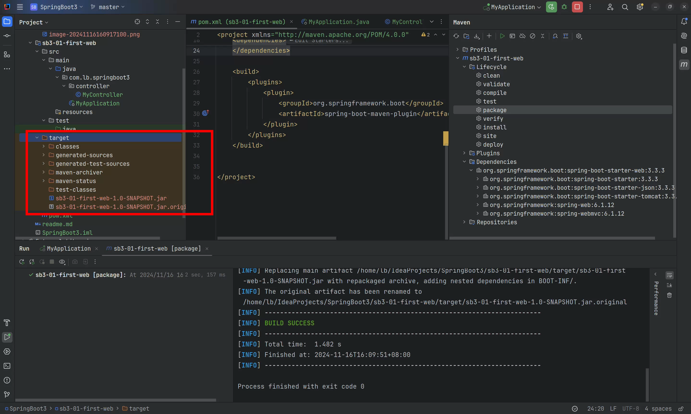

# 认识Spring Boot
Spring Boot倡导`约定优于配置`，将`简化开发`发挥到极致。使用Spring Boot框架可以快速构建Spring应用，再也不需要`大量的繁琐的`的各种配置。Spring Boot框架设计的目标是：程序员关注业务逻辑就行了，环境方面的事儿交给Spring Boot就行。

Spring Boot特性：

1. 快速创建独立的Spring应用程序。（Spring支持的SpringBoot都支持，也就是说SpringBoot全方位支持IoC，AOP等）
2. 嵌入式的Tomcat、Jetty、Undertow容器。（web服务器本身就是几个jar包，Spring Boot框架自动嵌入了。）
3. 需要什么功能时只需要引入对应的starter启动器即可。（启动器可以自动管理这个功能相关的依赖，自动管理依赖版本的控制）
4. 尽最大努力，最大可能的自动配置Spring应用和第三方库。（例如：如果要进行事务的控制，不用做任何事务相关的配置，只需要在service类上添加@Transactional注解即可。）
5. 没有代码生成，没有XML配置。（Spring Boot的应用程序在启动后不会动态地创建新的Java类，所有逻辑都是在编译期就已经确定好的）
6. 提供了生产监控的支持，例如健康检查，度量信息，跟踪信息，审计信息等。也支持集成外部监控系统。

Spring Boot的开箱即用和约定优于配置：

+ 开箱即用：Spring Boot框架设计得非常便捷，开发者能够在几乎不需要任何复杂的配置的情况下，快速搭建并运行一个功能完备的Spring应用。
+ 约定优于配置：“约定优于配置”（Convention Over Configuration, CoC）是一种软件设计哲学，核心思想是通过提供一组合理的默认行为来减少配置的数量，从而简化开发流程。例如：Spring Boot默认约定了使用某个事务管理器，在事务方面不需要做任何配置，只需要在对应代码的位置上使用`@Transactional`注解即可。

# 主要版本说明
Spring Boot版本：3.3.5

IDEA版本：2024.2.4

JDK版本：21（Spring Boot3要求JDK的最低版本是JDK17）

# First Spring Boot
需求：在浏览器上输入请求路径 http://localhost:8080/hello，在浏览器上显示 HelloWorld!

使用**<font style="color:#DF2A3F;">Spring Boot3 开发web应用</font>**，实现步骤如下：

## 第一步：创建一个空的工程，并设置JDK版本21（Spring Boot 3要求JDK最低版本是17）
## 第二步：设置maven
## 第三步：创建一个Maven模块 sb3-01-first-web
## 第四步：打开Spring Boot 3官方文档，按照文档一步一步进行
## 第五步：要使用Spring Boot 3，需要继承这个开源项目。从官方指导文档中复制以下内容：
```xml
<!--继承Spring Boot 3.3.3开源项目-->
<parent>
  <groupId>org.springframework.boot</groupId>
  <artifactId>spring-boot-starter-parent</artifactId>
  <version>3.3.3</version>
</parent>
```

我们开发的每一个项目其实可以看做是 Spring Boot 项目下的子项目。

## 第六步：添加Spring Boot的web starter
在parent下立即添加如下配置，让Spring Boot项目具备开发web应用的依赖：

```xml
<dependencies>
    <!--引入Spring Boot web启动器依赖-->
    <dependency>
        <groupId>org.springframework.boot</groupId>
        <artifactId>spring-boot-starter-web</artifactId>
    </dependency>
</dependencies>
```

关联的依赖也被引入进来，如下：


可以看到spring mvc被引入了，tomcat服务器也被引入了。

## 第七步：编写Spring Boot主入口程序
```java
package com.lb.springboot3;

import org.springframework.boot.SpringApplication;
import org.springframework.boot.autoconfigure.SpringBootApplication;

@SpringBootApplication
public class MyApplication {
    public static void main(String[] args) {
        SpringApplication.run(MyApplication.class, args);
    }
}
```

## 第八步：编写controller
```java
package com.lb.springboot3.controller;

import org.springframework.web.bind.annotation.RequestMapping;
import org.springframework.web.bind.annotation.ResponseBody;
import org.springframework.web.bind.annotation.RestController;

@RestController
@ResponseBody
public class MyController {

    @RequestMapping("/hello")
    public String hello() {
        return "Hello World";
    }
}

```

## 第九步：运行main方法就是启动web容器


## 第十步：打开浏览器访问


# 便捷的部署方式
## 打jar包运行
Spring Boot提供了打包插件，可以将Spring Boot项目打包为**<font style="color:#DF2A3F;">可执行 jar 包</font>**。Web服务器（Tomcat）也会连同一块打入jar包中。只要电脑上安装了Java的运行环境（JDK），就可以启动Spring Boot项目。

根据官方文档指导，使用打包功能需要引入以下的插件：

```xml
<build>
	<plugins>
		<plugin>
			<groupId>org.springframework.boot</groupId>
			<artifactId>spring-boot-maven-plugin</artifactId>
		</plugin>
	</plugins>
</build>
```


执行打包命令，生成可执行jar包：




单独的将这个 jar 包可以拷贝到任何位置运行，通过`java -jar sb3-01-first-web-1.0-SNAPSHOT.jar`命令来启动 Spring Boot 项目.

另外，Spring Boot框架为我们提供了非常灵活的配置，在可执行jar包的同级目录下新建配置文件：application.properties，并配置以下信息：

```properties
server.port=8888
```

重新启动服务器，然后使用新的端口号访问：

## SpringBoot的jar包和普通jar包的区别
Spring Boot 打包成的 JAR 文件与传统的 Java 应用程序中的 JAR 文件相比确实有一些显著的区别，主要体现在`依赖管理`和`可执行性`上。

**依赖管理**：

+ Spring Boot 的 JAR 包通常包含了应用程序运行所需的所有依赖项，也就是说它是一个“fat jar”（胖 JAR 包），这种打包方式使得应用可以独立运行，而不需要外部的类路径或应用服务器上的其他依赖。
+ 普通的 JAR 文件一般只包含一个类库的功能，并且需要依赖于特定的类路径来找到其他的类库或者框架，这些依赖项通常在部署环境中已经存在，比如在一个应用服务器中。

**可执行性**：

+ Spring Boot 的 JAR 文件可以通过直接执行这个 JAR 文件来启动应用程序，也就是说它是一个可执行的 JAR 文件。通过 `java -jar your-application.jar` 命令就可以直接运行应用程序。
+ 而普通的 JAR 文件通常是不可直接执行的，需要通过指定主类（main class）的方式或者其他方式来启动一个应用程序，例如使用 `-cp` 或 `-classpath` 加上类路径以及主类名来执行。

Spring Boot 的这些特性使得部署和运行变得更加简单和方便，特别是在微服务架构中，每个服务都可以被打包成独立的 JAR 文件并部署到任何支持 Java 的地方。


