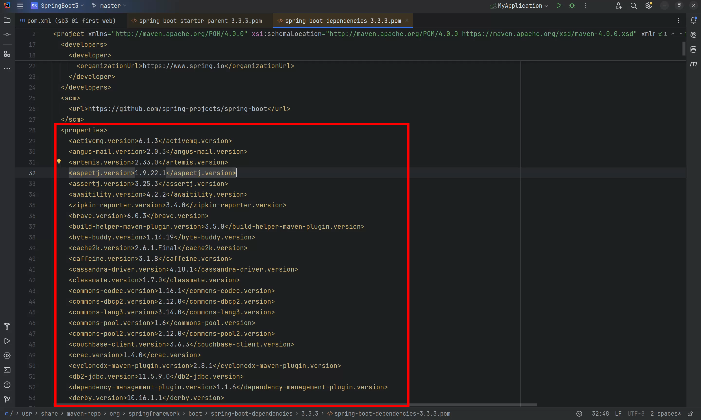
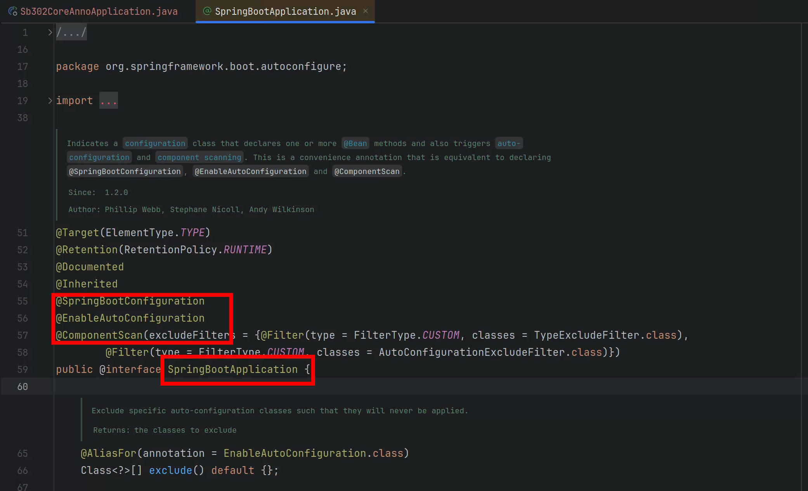
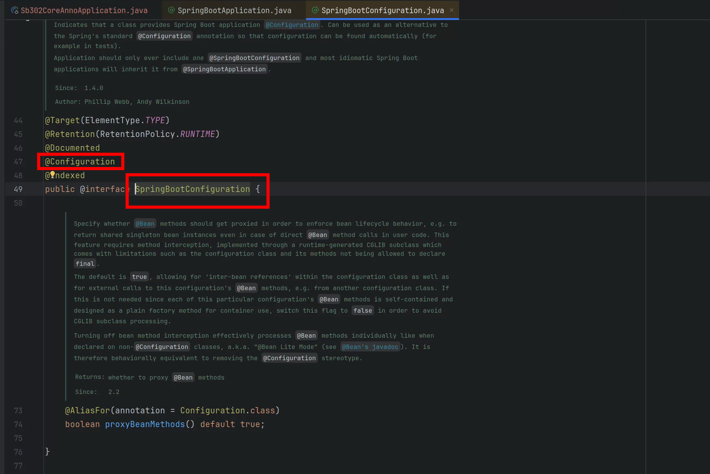
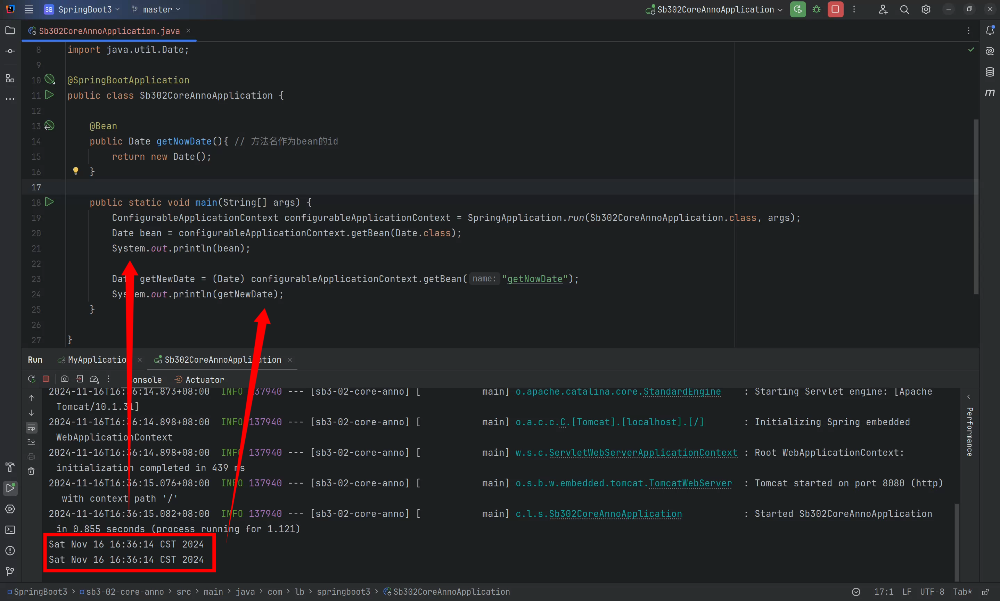
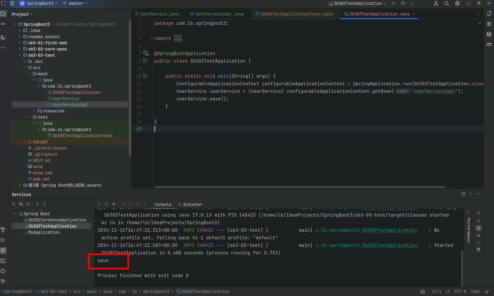

# 为何以继承方式引入SpringBoot
## 提出疑问
以前我们在开发项目时，需要什么，引入对应的依赖就行，比如我们需要连接mysql数据，则引入mysql驱动的依赖，如下：

```xml
<dependency>
  <groupId>com.mysql</groupId>
  <artifactId>mysql-connector-j</artifactId>
  <version>8.3.0</version>
</dependency>
```

现在我们要使用SpringBoot框架，按说也应该采用依赖的方式将SpringBoot框架引入，如下：

```xml
<dependency>
  <groupId>org.springframework.boot</groupId>
  <artifactId>spring-boot-starter-parent</artifactId>
  <version>3.3.3</version>
</dependency>
```

但是SpringBoot官方推荐的不是直接引入依赖，而是采用继承的方式实现，如下：

```xml
<parent>
    <groupId>org.springframework.boot</groupId>
    <artifactId>spring-boot-starter-parent</artifactId>
    <version>3.3.3</version>
</parent>
```

**<font style="color:#DF2A3F;">为什么？</font>**

## 作为父项目和作为依赖的区别
**继承父工程的优势**

+ 依赖管理：可以在父工程中定义依赖的版本，子模块可以直接引用而不必指定版本号。
+ 插件管理：可以在父工程中配置常用的插件及其版本，子模块可以直接使用这些配置。
+ 属性设置：可以在父工程中定义一些通用的属性，如项目编码、Java 版本等。
+ 统一配置：可以统一多个子模块的构建配置，确保一致性。

**直接引入依赖的局限性**（如果你不使用继承父工程的方式，而是通过直接引入依赖的方式来管理项目，那么你将失去上述的一些优势）

+ 依赖版本管理：每个子模块都需要单独指定依赖的版本，这会导致大量的重复配置，并且难以维护。
+ 插件配置：每个子模块都需要单独配置插件及其版本，无法共享父工程中的插件配置。
+ 属性设置：每个子模块都需要单独设置通用的属性，如项目编码、Java 版本等。
+ 构建配置：每个子模块的构建配置需要单独维护，难以保证一致性。

**<font style="color:#DF2A3F;">总结：选择哪种方式取决于你的具体需求。</font>**

+ **<font style="color:#DF2A3F;">如果你希望多个项目之间共享构建配置，那么使用父项目是一个好的选择；</font>**
+ **<font style="color:#DF2A3F;">如果你只是想在项目之间共享代码，那么应该使用依赖关系。</font>**

## 原理揭晓
通过源码来分析一下：



通过上图源码可以看到Spring Boot预先对开发中需要用到的依赖进行了版本的统一管理。我们需要和SpringBoot框架共享这个构建配置。因此官方推荐使用继承的方式引入SpringBoot框架。

## 依赖统一管理的好处
Spring Boot 框架的一个重要特性就是简化了项目依赖管理。它通过提供一个叫做“依赖管理”的功能来帮助开发者更容易地管理和使用第三方库和其他 Spring 组件。具体来说，Spring Boot 提供了一个包含多个 Spring 和其他常用库的依赖版本配置文件（通常是在 `spring-boot-dependencies` 文件中），这使得开发者不需要在自己的项目中显式指定这些依赖的版本号。

这样做有以下几个好处：

1. **简化依赖声明**：  
开发者只需要在 `pom.xml` 文件中声明需要的依赖而不需要指定其版本号，因为 Spring Boot 已经为这些依赖指定了版本。例如，如果你需要使用mysql驱动，你只需要添加相应的依赖声明而不需要关心版本。

```xml
<dependency>
    <groupId>com.mysql</groupId>
    <artifactId>mysql-connector-j</artifactId>
</dependency>
```

2. **避免版本冲突**：  
当多个库之间存在依赖关系的时候，如果手动管理版本可能会导致版本之间的冲突（即“依赖地狱”）。Spring Boot 提供的统一版本管理可以减少这种冲突的可能性。
3. **易于升级**：  
当 Spring Boot 发布新版本时，通常会更新其依赖库到最新稳定版。因此，当你升级 Spring Boot 版本时，它所管理的所有依赖也会随之更新到兼容的版本。
4. **减少配置错误**：  
由于 Spring Boot 自动处理了依赖的版本，减少了手动输入版本号可能引入的拼写或格式错误。
5. **提高开发效率**：  
开发者可以专注于业务逻辑的编写，而不是花费时间在解决依赖问题上。

总的来说，Spring Boot 的依赖管理功能使得开发者可以更加专注于业务逻辑的实现，同时减少了因依赖版本不一致而引发的问题，提高了项目的可维护性和开发效率。

当然，如果你在项目中需要更改某个依赖的版本号，不想使用SpringBoot框架指定的版本号，只需要在引入依赖时强行执行版本号即可，maven是支持就近原则的：

这样做就是采用SpringBoot指定版本的依赖：

```xml
<dependency>
    <groupId>com.mysql</groupId>
    <artifactId>mysql-connector-j</artifactId>
</dependency>
```

# Starter-启动器
在 Spring Boot 中，启动器（Starter）本质上是一个简化依赖管理的概念。

Spring Boot 的启动器本质上就是一组预定义的依赖集合，它们被组织成一个个 Maven的依赖，以方便开发者快速集成特定的功能模块。

如果你想做web开发，只需要引入web启动器。web启动器会自动引入web开发所需要的子依赖。

## 启动器实现原理
1. **依赖聚合**：  
每个启动器通常对应一个特定的功能集或者一个完整的应用模块，如 `spring-boot-starter-web` 就包含了构建 Web 应用所需的所有基本依赖项，如 Spring MVC, Tomcat 嵌入式容器等。
2. **依赖传递**：  
当你在项目中引入一个启动器时，它不仅会把自身作为依赖加入到你的项目中，还会把它的所有直接依赖项（transitive dependencies）也加入进来。这意味着你不需要单独声明这些依赖项，它们会自动成为项目的一部分。
3. **版本管理**：  
启动器内部已经指定了所有依赖项的具体版本，这些版本信息存储在一个公共的 BOM（Bill of Materials，物料清单）文件中，通常是 `spring-boot-dependencies`。当引入启动器时，实际上也间接引用了这个 BOM，从而确保了所有依赖项版本的一致性。
4. **自动配置**：  
许多启动器还提供了自动配置（Auto-configuration），这是一种机制，允许 Spring Boot 根据类路径上的可用组件自动设置你的应用程序。例如，如果类路径上有 Spring MVC 和嵌入式 Tomcat，则 Spring Boot 会自动配置它们，并准备好一个 web 应用程序。

**使用启动器的示例**

假设你想创建一个基于 Spring MVC 的 RESTful Web 应用，你可以简单地将 `spring-boot-starter-web` 添加到你的项目中：

```xml
<dependency>
    <groupId>org.springframework.boot</groupId>
    <artifactId>spring-boot-starter-web</artifactId>
</dependency>
```

当你添加这个依赖时，Spring Boot 会处理所有必要的细节，包括添加 Spring MVC 和 Tomcat 作为嵌入式 Servlet 容器，并且根据类路径上的内容进行适当的自动配置。如下图所示：


这就是 Spring Boot 启动器的基本实现原理，它简化了依赖管理，让开发者能够更专注于业务逻辑的实现。

## 都有哪些启动器
启动器通常包括：

+ SpringBoot官方提供的启动器
+ 非官方提供的启动器

### 官方提供的启动器
启动器命名特点：spring-boot-starter-*

### 非官方的启动器
启动器命名特点：*-spring-boot-starter

# Spring Boot核心注解
创建一个新的模块，来学习Spring Boot核心注解：

只加入web启动器。

## @SpringBootApplication注解
Spring Boot的主入口程序被`@SpringBootApplication`注解标注，可见这个注解的重要性，查看它的源码：



可以看出这个注解属于`组合注解`。拥有`@SpringBootConfiguration`、`@EnableAutoConfiguration`、`@ComponentScan`的功能。	

## @SpringBootConfiguration注解
@SpringBootConfiguration注解的源码如下：



可以看到这个注解的被`@Configuration`标注，说明`主入口`程序是一个配置类。也就是说主入口中的方法可以被`@Bean`注解标注，被`@Bean`注解的标注的方法会被Spring容器自动调用，并且将该方法的返回对象纳入IoC容器的管理。测试一下：

```java
package com.lb.springboot3;

import org.springframework.boot.SpringApplication;
import org.springframework.boot.autoconfigure.SpringBootApplication;
import org.springframework.context.ConfigurableApplicationContext;
import org.springframework.context.annotation.Bean;

import java.util.Date;

@SpringBootApplication
public class Sb302CoreAnnoApplication {

	@Bean
	public Date getNowDate(){ // 方法名作为bean的id
		return new Date();
	}

	public static void main(String[] args) {
		ConfigurableApplicationContext configurableApplicationContext = SpringApplication.run(Sb302CoreAnnoApplication.class, args);
		Date bean = configurableApplicationContext.getBean(Date.class);
		System.out.println(bean);

		Date getNewDate = (Date) configurableApplicationContext.getBean("getNowDate");
		System.out.println(getNewDate);
	}

}
```

执行结果：



通过测试我们也认证了这一点：`SpringBoot主入口类实际上就是一个配置类`。这个`配置类`也可以称为`源`，起源的意思，SpringBoot从这个配置类开始加载项目中所有的bean。

## @EnableAutoConfiguration注解
该注解表示`启用自动配置`。

Spring Boot 会根据你引入的依赖自动为你配置好一系列的 Bean，无需手动编写复杂的配置代码。

例如：如果你在SpringBoot项目中进行了如下配置：

```properties
spring.datasource.driver-class-name=com.mysql.cj.jdbc.Driver
spring.datasource.url=jdbc:mysql://localhost:3306/xxx
spring.datasource.username=root
spring.datasource.password=123456
```

并且在依赖中引入了`mybatis依赖`/`mybatis启动器`，那么SpringBoot框架将为你自动化配置以下bean：

+ **SqlSessionFactory**: MyBatis的核心工厂SqlSessionFactory会被自动配置。这个工厂负责创建SqlSession实例，后者用来执行映射文件中的SQL语句。
+ **TransactionManager**: DataSourceTransactionManager会被自动配置来管理与数据源相关的事务。

## @ComponentScan注解
这个注解的作用是：启动组件扫描功能，代替spring框架xml文件中这个配置：

```xml
<context:component-scan base-package="com.powernode.sb305core"/>
```

因此被`@SpringBootApplication`注解标注之后，会启动组件扫描功能，扫描的包是`主入口程序所在包及子包`，因此如果一个bean要纳入IoC容器的管理则必须放到主入口程序所在包及子包下。放到主入口程序所在包之外的话，扫描不到。

# Spring Boot的单元测试
## 不使用单元测试怎么调用service
### 创建模块
使用脚手架创建sb3-06-test模块，不添加任何启动器：		

### 编写service


```java
package com.lb.springboot3;

import org.springframework.stereotype.Service;

@Service
public class UserServiceImpl implements UserService {
    @Override
    public void save() {
        System.out.println("save");
    }
}
```

### 直接在入口程序中调用service
```java
package com.lb.springboot3;

import org.springframework.boot.SpringApplication;
import org.springframework.boot.autoconfigure.SpringBootApplication;
import org.springframework.context.ConfigurableApplicationContext;

@SpringBootApplication
public class Sb303TestApplication {

	public static void main(String[] args) {
		ConfigurableApplicationContext configurableApplicationContext = SpringApplication.run(Sb303TestApplication.class, args);
		UserService userService = (UserService) configurableApplicationContext.getBean("userServiceImpl");
		userService.save();
	}

}
```

执行结果：



这种方式就是手动获取Spring上下文对象`ConfigurableApplicationContext`，然后调用getBean方法从Spring容器中获取service对象，然后调用方法。

## 使用单元测试怎么调用service
### test-starter引入以及测试类编写
使用单元测试应该如何调用service对象上的方法呢？

在使用脚手架创建Spring Boot项目时，为我们生成了单元测试类

当然，如果要使用单元测试，需要引入单元测试启动器，如果使用脚手架创建SpringBoot项目，这个test启动器会自动引入：

```xml
<dependency>
    <groupId>org.springframework.boot</groupId>
    <artifactId>spring-boot-starter-test</artifactId>
    <scope>test</scope>
</dependency>
```

### @SpringBootTest注解
`@SpringBootTest` 会创建一个完整的 Spring 应用程序上下文（Application Context），这个上下文包含了应用程序的所有组件和服务。以下是 `@SpringBootTest` 做的一些主要工作：

1. **创建 ApplicationContext**：
    - `@SpringBootTest` 使用 `SpringApplication` 的 `run()` 方法来启动一个 Spring Boot 应用程序上下文。这意味着它会加载应用程序的主配置类和其他相关的配置类。
2. **加载配置文件**：
    - 它会查找并加载默认的配置文件，如 `application.properties`
3. **自动配置**：
    - 如果应用程序依赖于 Spring Boot 的自动配置特性，`@SpringBootTest` 会确保这些自动配置生效。这意味着它会根据可用的类和bean来自动配置一些组件，如数据库连接、消息队列等。
4. **注入依赖**：
    - 使用 `@SpringBootTest` 创建的应用程序上下文允许你在测试类中使用 `@Autowired` 注入需要的 bean，就像在一个真实的 Spring Boot 应用程序中一样。

总的来说，`@SpringBootTest` 为你的测试提供了尽可能接近实际运行时环境的条件，这对于验证应用程序的行为非常有用。

### 注入service并调用
```java
@SpringBootTest
class Sb306TestApplicationTests {

    @Autowired
    private UserService userService;
    
    @Test
    void contextLoads() {
        userService.save();
    }

}
```

# 外部化配置
## 什么是外部化配置
外部化配置是指：将`配置信息`存储在`应用程序代码`之外的地方。这样`配置信息`可以独立于代码进行管理。这样方便了配置的修改，并且修改后不需要重新编译代码，也不需要重新部署项目。

### 外部化配置的方式
SpringBoot支持多种外部化配置方式，包括但不限于：

+ properties文件
+ YAML文件
+ 系统环境变量
+ 命令行参数
+ ......

### 外部化配置的优势
1. **灵活性**：配置文件可以独立于应用程序部署，这使得可以根据运行环境的不同来调整配置，而无需修改代码。
2. **易于维护**：配置变更不需要重新构建和部署应用程序，降低了维护成本。
3. **安全性**：敏感信息如数据库密码、API密钥等可以存储在外部，并且可以限制谁有权限访问这些配置信息。
4. **共享性**：多实例或多服务可以共享相同的配置信息，减少重复配置的工作量。
5. **版本控制**：配置文件可以存放在版本控制系统中，便于跟踪历史版本和回滚配置。

总之，外部化配置使得配置更加灵活、安全、易于管理和共享，是现代云原生应用中非常推荐的做法

### 外部化配置对比传统配置
在传统的SSM三大框架中，如果修改XML的配置后，需要对应用重新打包，重新部署。

使用SpringBoot框架的`外部化配置`后，修改配置后，不需要对应用重新打包，也不需要重新部署，最多重启一下服务即可。

## application.properties
`application.properties`配置文件是SpringBoot框架默认的配置文件。

`application.properties`不是必须的，SpringBoot对于应用程序来说，都提供了一套默认配置（就是我们所说的自动配置）。

如果你要改变这些默认的行为，可以在`application.properties`文件中进行配置。

`application.properties`可以放在类路径当中，也可以放在项目之外。因此称为外部化配置。


Spring Boot 框架在启动时会尝试从以下位置加载 `application.properties` 配置文件：

1. **file:./config/**：首先在Spring Boot 当前工作目录下的 `config` 文件夹中查找。
    1. **<font style="color:#DF2A3F;">注意：如果没有找到</font>**`**<font style="color:#DF2A3F;">application.properties</font>**`**<font style="color:#DF2A3F;">会继续找</font>**`**<font style="color:#DF2A3F;">application.yml</font>**`**<font style="color:#DF2A3F;">，如果这两个都没有找到，才会进入以下位置查找，以此类推。</font>**
2. **file:./**：如果在当前工作目录下`config`目录中找不到时，再从当前工作目录中查找。
3. **classpath:/config/**：如果从工作目录中找不到，会从类路径中找，先从类路径的 `/config/` 目录下寻找配置文件。
4. **classpath:/**：如果在 `/config/` 下没有找到，它会在类路径的根目录下查找。

Spring Boot 会按照这个顺序来加载配置文件，如果在多个位置有相同的属性定义，那么最先检查的位置中的属性值将优先使用。

如果你想要指定其他的配置文件位置或者改变默认的行为，可以通过 `--spring.config.location=` 后跟路径的方式来指定配置文件的具体位置。例如 ：

```plain
java -jar sb3-01-first-web-1.0-SNAPSHOT.jar --spring.config.location=file:///E:\a\b\application.properties
```

这样，Spring Boot 将会首先从 `E:\a\b\` 这个路径加载配置文件。注意，这种方式可以用来覆盖默认的配置文件位置，并且可以结合以上提到的位置一起使用。

注意：以上的`--spring.config.location=file:///E:\a\b\application.properties`就属于命令行参数，它将来会被传递到main方法的(String[] args)参数上。

## 使用@Value注解
@Value注解可以将`application.properties`/`application.yml`文件中的配置信息注入/绑定到java对象的属性上。

**<font style="color:#DF2A3F;">语法格式：@Value("${key}")</font>**

使用脚手架创建SpringBoot项目，不添加任何启动器：

在`resources/application.properties`文件中进行如下配置：

```properties
myapp.username=jack
myapp.email=jack@123.com
myapp.age=30
```

编写service类：

```java
@Service("userService")
public class UserService {
    
    @Value("${myapp.username}")
    private String username;
    
    @Value("${myapp.email}")
    private String email;
    
    @Value("${myapp.age}")
    private Integer age;
    
    public void printInfo(){
        String str = String.join(",", username, email, String.valueOf(age));
        System.out.println(str);
    }
}
```

编写单元测试：

```java
@SpringBootTest
class Sb307ExternalConfigApplicationTests {
    @Autowired
    private UserService userService;
    @Test
    void test01() {
        userService.printInfo();
    }
}
```

使用@Value注解时也可以指定默认值，当指定默认值时，如果配置文件中没有指定配置值，则采用默认值。

**<font style="color:#DF2A3F;">语法格式：@Value("${key:defalut}")</font>**

```java
@Service("userService")
public class UserService {

    @Value("${myapp.username}")
    private String username;

    @Value("${myapp.email}")
    private String email;

    @Value("${myapp.age}")
    private Integer age;
    
    @Value("${myapp.password:123456}")
    private String password;

    public void printInfo(){
        String str = String.join(",", username, email, String.valueOf(age), password);
        System.out.println(str);
    }
}
```

当然，如果配置文件进行了相关的配置，则不会采用默认值，修改配置文件`application.properties`：

## YAML
### YAML概述
SpringBoot采用集中式配置管理，所有的配置都编写到一个配置文件中：`application.properties`

如果配置非常多，层级不够分明，因此SpringBoot为了提高配置文件可读性，也支持YAML格式的配置文件：`application.yml`

YAML（YAML Ain't Markup Language）是一种人类可读的数据序列化格式，它通常用于配置文件，在各种编程语言中作为一种存储或传输数据的方式。YAML的设计目标是易于阅读和编写，同时保持足够的表达能力来表示复杂的数据结构。

**<font style="color:#DF2A3F;">YAML文件的扩展名可以是</font>**`**<font style="color:#DF2A3F;">.yaml</font>**`**<font style="color:#DF2A3F;">或</font>**`**<font style="color:#DF2A3F;">.yml</font>**`**<font style="color:#DF2A3F;">。</font>**

### 常见的数据存储和交换格式
`properties`、`XML`、`JSON`、`YAML`这几种格式确实是用来存储和交换数据的常见方式，但它们各有特点和适用场景：

**Properties**

+ 这种格式主要用于Java应用程序中的配置文件。它是键值对的形式，每一行是一个键值对，使用等号或冒号分隔键和值。
+ 特点是简单易懂，但在处理复杂结构的数据时显得力不从心。

**XML (eXtensible Markup Language)**

+ XML是一种标记语言，用来描述数据的格式。它支持复杂的数据结构，包括嵌套和属性。
+ XML文档具有良好的结构化特性，适合传输和存储结构化的数据。但是，XML文档通常体积较大，解析起来也比较耗资源。

**JSON (JavaScript Object Notation)**

+ JSON是一种轻量级的数据交换格式，易于人阅读和编写，同时也易于机器解析和生成。它基于JavaScript的一个子集，支持多种数据类型，如数字、字符串、布尔值、数组和对象。
+ JSON因为简洁和高效而广泛应用于Web应用程序之间进行数据交换。

**YAML (YAML Ain't Markup Language)**

+ YAML设计的目标之一就是让人类更容易阅读。它支持类似JSON的数据序列化，但提供了更多的灵活性，例如缩进来表示数据结构。
+ YAML非常适合用来编写配置文件，因为它允许以一种自然的方式组织数据，并且可以包含注释和其他人类可读的元素。

总结来说，这四种格式都可以用来存储和交换数据，但它们的设计初衷和最佳使用场景有所不同。选择哪种格式取决于具体的应用需求、数据复杂度、性能要求等因素。

### YAML的语法规则
YAML的语法规则如下：

1. 数据结构：YAML支持多种数据类型，包括：
    1. 字符串、数字、布尔值
    2. 数组、list集合
    3. map键值对   等。
2. YAML使用`一个空格`来分隔`属性名`和`属性值`，例如：
    1. `properties`文件中这样的配置：name=jack
    2. `yaml`文件中需要这样配置：name: jack
3. YAML用`换行+空格`来表示层级关系。注意不能使用tab，必须是空格，空格数量无要求，大部分建议2个或4个空格。例如：
    1. `properties`文件中这样的配置：myapp.name=mall
    2. `yaml`文件中就需要这样配置：

```yaml
myapp:
  name: mall
```

4. 同级元素左对齐。例如：
    1. `properties`文件中有这样的配置：

```properties
myapp.name=mall
myapp.count=10
```

    2. `yaml`文件中就应该这样配置：

```yaml
myapp:
  name: mall
  count: 10
```

5. 键必须是唯一的：在一个映射中，键必须是唯一的。
6. 注释：使用`#`进行注释。
7. 大小写敏感

### YAML的使用小细节
第一：普通文本也可以使用单引号或双引号括起来：（当然普通文本也可以不使用单引号和双引号括起来。）

+ 单引号括起来：单引号内所有的内容都被当做普通文本，不转义（例如字符串中有\n，则\n被当做普通的字符串）
+ 双引号括起来：双引号中有 \n 则会被转义为换行符

第二：保留文本格式

+ |      将文本写到这个符号的下层，会自动保留格式。

第三：文档切割

+ --- 这个符号下面的配置可以认为是一个独立的yaml文件。便于庞大文件的阅读。

**<font style="color:#DF2A3F;"></font>**

### application.yml
Spring Boot框架同时支持`properties`和`yaml`。

**<font style="color:#DF2A3F;">强调：在同一个目录下同时存在</font>**`**<font style="color:#DF2A3F;">application.properties</font>**`**<font style="color:#DF2A3F;">和</font>**`**<font style="color:#DF2A3F;">application.yml</font>**`**<font style="color:#DF2A3F;">时，SpringBoot优先解析</font>**`**<font style="color:#DF2A3F;">application.properties</font>**`**<font style="color:#DF2A3F;">文件。</font>**

在`resources/config`目录下新建`application.yml`文件，进行如下配置：

```yaml
myapp:
  username: jim
  email: jim@123.com	
  age: 40
  password: jim123
```

一定要把`resources/config`目录下`application.properties`名字修改为`application2.properties`，这样Spring Boot才会解析`resources/config/application.yml`。

## 配置文件合并
一个项目中所有的配置全部编写到`application.properties`文件中，会导致配置臃肿，不易维护，有时我们会将配置编写到不同的文件中，例如：`application-mysql.properties`专门配置mysql的信息，`application-redis.properties`专门配置redis的信息，最终将两个配置文件合并到一个配置文件中。

### properties文件
`application-mysql.properties`

```properties
spring.datasource.username=root
spring.datasource.password=123456
```

`application-redis.properties`

```properties
spring.data.redis.host=localhost	
spring.data.redis.port=6379
```

`application.properties`

```properties
spring.config.import=classpath:application-mysql.properties,classpath:application-redis.properties
```

编写service测试，看看能否拿到配置信息：

```java
package com.powernode.sb307externalconfig.service;

import org.springframework.beans.factory.annotation.Value;
import org.springframework.stereotype.Service;

@Service("userServiceMulti")
public class UserServiceMulti {
    @Value("${spring.datasource.username}")
    private String username;
    @Value("${spring.datasource.password}")
    private String password;
    @Value("${spring.data.redis.host}")
    private String host;
    @Value("${spring.data.redis.port}")
    private String port;
    
    public void printInfo(){
        String str = String.join(",", username, password, host, port);
        System.out.println(str);
    }
}
```

运行测试：

### yaml文件
`application-mysql.yml`

```yaml
spring:
  datasource:
    username: root
    password: 789789
```

`application-redis.yml`

```yaml
spring:
  data:
    redis:
      host: localhost
      port: 6379
```

`application.yml`

```yaml
spring:
  config:
    import:
      - classpath:application-mysql.yml
      - classpath:application-redis.yml
```

## 多环境切换
在Spring Boot中，多环境切换是指在一个应用程序中支持多种运行环境配置的能力。这通常用于区分开发（development）、测试（testing）、预生产（staging）和生产（production）等不同阶段的环境。

这种功能使得开发者能够在不同的环境中使用不同的配置，比如数据库连接信息、服务器端口、环境变量等，而不需要更改代码。这对于维护一个可移植且易于管理的应用程序非常重要。

1. 开发环境的配置文件名一般叫做：`application-dev.properties`

```properties
spring.datasource.username=dev
spring.datasource.password=dev123
spring.datasource.url=jdbc:mysql://localhost:3306/dev
```

2. 测试环境的配置文件名一般叫做：`application-test.properties`

```properties
spring.datasource.username=test
spring.datasource.password=test123
spring.datasource.url=jdbc:mysql://localhost:3306/test
```

3. 预生产环境的配置文件名一般叫做：`application-preprod.properties`

```properties
spring.datasource.username=preprod
spring.datasource.password=preprod123
spring.datasource.url=jdbc:mysql://localhost:3306/preprod
```

4. 生产环境的配置文件名一般叫做：`application-prod.properties`

```properties
spring.datasource.username=prod
spring.datasource.password=prod123
spring.datasource.url=jdbc:mysql://localhost:3306/prod
```


如果你希望该项目使用生产环境的配置，你可以这样做：

+ 第一种方式：在`application.properties`文件中添加这个配置：**spring.profiles.active=prod**
+ 第二种方式：在命令行参数上添加：**--spring.profiles.active=prod**

## 将配置绑定到bean
### 绑定简单bean
SpringBoot配置文件中的信息除了可以使用`@Value注解`读取之外，也可以将配置信息一次性赋值给Bean对象的属性。

例如有这样的配置：

`application.yml`

```yaml
app:
  name: jack
  age: 30
  email: jack@123.com	
```

Bean需要这样定义：

```java
package com.powernode.sb307externalconfig.bean;

import org.springframework.boot.context.properties.ConfigurationProperties;
import org.springframework.stereotype.Component;

@Component
@ConfigurationProperties(prefix = "app")
public class AppBean {
    private String name;
    private Integer age;
    private String email;

    @Override
    public String toString() {
        return "AppBean{" +
                "name='" + name + '\'' +
                ", age=" + age +
                ", email='" + email + '\'' +
                '}';
    }

    public String getName() {
        return name;
    }

    public void setName(String name) {
        this.name = name;
    }

    public Integer getAge() {
        return age;
    }

    public void setAge(Integer age) {
        this.age = age;
    }

    public String getEmail() {
        return email;
    }

    public void setEmail(String email) {
        this.email = email;
    }
}
```

说明：

1. 被绑定的bean，需要使用`@ConfigurationProperties(prefix = "app")`注解进行标注，prefix用来指定前缀，哪个是前缀，如下图所示：

配置文件中的`name`、`age`、`email`要和bean对象的属性名`name`、`age`、`email`对应上。（属性名相同）

并且bean中的所有属性都提供了`setter`方法。因为底层是通过`setter`方法给bean属性赋值的。

2. 这样的bean需要使用`@Component`注解进行标注，纳入IoC容器的管理。`@Component`注解负责创建Bean对象，`@ConfigurationProperties(prefix = "app")`注解负责给bean对象的属性赋值。
3. bean的属性需要是`非static`的属性。

### @Configuration注解
以上操作中使用了`@Component注解`进行了标注，来纳入IoC容器的管理。也可以使用另外一个注解`@Configuration`，用这个注解将Bean标注为配置类。多数情况下我们会选择使用这个注解，因为该Bean对象的属性对应的就是配置文件中的配置信息，因此这个Bean我们也可以将其看做是一个配置类。

```java
@Configuration
@ConfigurationProperties(prefix = "app")
public class AppBean {
    private String name;
    private Integer age;
    private String email;
    //setter and getter
}
```


我们把这个Bean对象的类名打印一下看看：

可以发现底层实际上创建了`AppBean`的代理对象`AppBean$$SpringCGLIB`。

生成代理对象会影响效率，这里我们不需要使用代理功能，可以通过以下配置来取消代理机制：

```java
@Configuration(proxyBeanMethods = false)
@ConfigurationProperties(prefix = "app")
public class AppBean {
    private String name;
    private Integer age;
    private String email;
    //setter and getter
}
```

### 绑定嵌套bean
当一个Bean中嵌套了一个Bean，这种情况下可以将配置信息绑定到该Bean上吗？当然可以。

有这样的一个配置：

```yaml
app:
  name: jack
  age: 30
  email: jack@123.com
  address: 
    city: BJ
    street: ChaoYang
    zipcode: 123456
```

需要编写这样的两个Bean：

```java
@Configuration(proxyBeanMethods = false)
@ConfigurationProperties(prefix = "app")
public class AppBean {
    private String name;
    private Integer age;	
    private String email;
    private Address address;

    @Override
    public String toString() {
        return "AppBean{" +
                "name='" + name + '\'' +
                ", age=" + age +
                ", email='" + email + '\'' +
                ", address=" + address +
                '}';
    }

    public Address getAddress() {
        return address;
    }

    public void setAddress(Address address) {
        this.address = address;
    }

    public String getName() {
        return name;
    }

    public void setName(String name) {
        this.name = name;
    }

    public Integer getAge() {
        return age;
    }

    public void setAge(Integer age) {
        this.age = age;
    }

    public String getEmail() {
        return email;
    }

    public void setEmail(String email) {
        this.email = email;
    }
}

```


```java
public class Address {
    private String city;
    private String street;
    private String zipcode;

    public String getCity() {
        return city;
    }

    public void setCity(String city) {
        this.city = city;
    }

    public String getStreet() {
        return street;
    }

    public void setStreet(String street) {
        this.street = street;
    }

    public String getZipcode() {
        return zipcode;
    }

    public void setZipcode(String zipcode) {
        this.zipcode = zipcode;
    }

    @Override
    public String toString() {
        return "Address{" +
                "city='" + city + '\'' +
                ", street='" + street + '\'' +
                ", zipcode='" + zipcode + '\'' +
                '}';
    }
}

```

### <font style="color:#080808;background-color:#ffffff;">@EnableConfigurationProperties与@ConfigurationPropertiesScan</font>
将`AppBean`纳入IoC容器的管理，之前我们说了两种方式：第一种是使用`@Component`，第二种是使用`@Configuration`。SpringBoot其实还提供了另外两种方式：

+ 第一种：@EnableConfigurationProperties
+ 第二种：@<font style="color:#080808;background-color:#ffffff;">ConfigurationPropertiesScan</font>

<font style="color:#080808;background-color:#ffffff;">这两个注解都是标注在SpringBoot主入口程序上的：</font>

```java
@EnableConfigurationProperties(AppBean.class)
@SpringBootApplication
public class Sb304ExternalConfigApplication {
	public static void main(String[] args) {
		SpringApplication.run(Sb304ExternalConfigApplication.class, args);
	}
}
```

或者

```java
@ConfigurationPropertiesScan(basePackages = "com.lb.xxx.bean")
@SpringBootApplication
public class Sb304ExternalConfigApplication {
	public static void main(String[] args) {
		SpringApplication.run(Sb304ExternalConfigApplication.class, args);
	}
}
```

### 将配置赋值到Bean的Map/List/Array属性上
代码如下：

```java
import org.springframework.boot.context.properties.ConfigurationProperties;

import java.util.Arrays;
import java.util.List;
import java.util.Map;

@ConfigurationProperties
public class CollectionConfig {
    private String[] names;
    private List<Product> products;
    private Map<String, Vip> vips;

    @Override
    public String toString() {
        return "CollectionConfig{" +
                "names=" + Arrays.toString(names) +
                ", products=" + products +
                ", vips=" + vips +
                '}';
    }

    public String[] getNames() {
        return names;
    }

    public void setNames(String[] names) {
        this.names = names;
    }

    public List<Product> getProducts() {
        return products;
    }

    public void setProducts(List<Product> products) {
        this.products = products;
    }

    public Map<String, Vip> getVips() {
        return vips;
    }

    public void setVips(Map<String, Vip> vips) {
        this.vips = vips;
    }
}

class Product {
    private String name;
    private Double price;

    @Override
    public String toString() {
        return "Product{" +
                "name='" + name + '\'' +
                ", price=" + price +
                '}';
    }

    public String getName() {
        return name;
    }

    public void setName(String name) {
        this.name = name;
    }

    public Double getPrice() {
        return price;
    }

    public void setPrice(Double price) {
        this.price = price;
    }
}

class Vip {
    private String name;
    private Integer age;

    @Override
    public String toString() {
        return "Vip{" +
                "name='" + name + '\'' +
                ", age=" + age +
                '}';
    }

    public String getName() {
        return name;
    }

    public void setName(String name) {
        this.name = name;
    }

    public Integer getAge() {
        return age;
    }

    public void setAge(Integer age) {
        this.age = age;
    }
}
```

配置信息如下：`application.yml`

```yaml
#数组
names:
  - jackson
  - lucy
  - lili

#List集合
products: 
  - name: 西瓜
    price: 3.0
  - name: 苹果
    price: 2.0

#Map集合
vips:
  vip1:
    name: 张三
    age: 20
  vip2:
    name: 李四
    age: 22
```


提醒：记得入口程序使用<font style="color:#080808;background-color:#ffffff;">@ConfigurationPropertiesScan(basePackages = "com.xxx.bean")进行标注。</font>

<font style="color:#080808;background-color:#ffffff;"></font>

### 将配置绑定到第三方对象
将配置文件中的信息绑定到某个Bean对象上，如果这个Bean对象没有源码，是第三方库提供的，怎么办？

此时可以单独编写一个方法，在方法上使用以下两个注解进行标注：

+ **@Bean**
+ **@ConfigurationProperties**

假设我们有这样一个类`Address`，代码如下：

```java
public class Address {
    private String city;
    private String street;
    private String zipcode;

    public String getCity() {
        return city;
    }

    public void setCity(String city) {
        this.city = city;
    }

    public String getStreet() {
        return street;
    }

    public void setStreet(String street) {
        this.street = street;
    }

    public String getZipcode() {
        return zipcode;
    }

    public void setZipcode(String zipcode) {
        this.zipcode = zipcode;
    }

    @Override
    public String toString() {
        return "Address{" +
                "city='" + city + '\'' +
                ", street='" + street + '\'' +
                ", zipcode='" + zipcode + '\'' +
                '}';
    }
}

```

当然，我们是看不到这个源码的，只知道有这样一个字节码`Address.class`。大家也可以看到这个`Address`类上没有添加任何注解。假设我们要将以下配置绑定到这个Bean上应该怎么做？

```yaml
address:
  city: TJ
  street: XiangYangLu
  zipcode: 11111111
```

实现代码如下：

```java
@Configuration
public class ApplicationConfig {
    @Bean
    @ConfigurationProperties(prefix = "address")
    public Address getAddress(){
        return new Address();
    }
}
```

### 指定数据来源
之前所讲的内容是将Spring Boot框架默认的配置文件`application.properties`或`application.yml`作为数据的来源绑定到Bean上。如果配置信息没有在默认的配置文件中呢？可以使用@PropertySource注解指定配置文件的位置，这个配置文件可以是`.properties`，也可以是`.xml`。这里重点掌握`.properties`即可。

在`resources`目录下新建`a`目录，在`a`目录下新建`b`目录，`b`目录中新建`group-info.properties`文件，进行如下的配置：

```properties
group.name=IT
group.leader=LaoDu
group.count=20
```

定义Java类`Group`，然后进行注解标注：

```java
package com.powernode.sb307externalconfig.bean;

import org.springframework.boot.context.properties.ConfigurationProperties;
import org.springframework.context.annotation.Configuration;
import org.springframework.context.annotation.PropertySource;

@Configuration
@ConfigurationProperties(prefix = "group")
@PropertySource("classpath:a/b/group-info.properties")
public class Group {
    private String name;
    private String leader;
    private Integer count;

    @Override
    public String toString() {
        return "Group{" +
                "name='" + name + '\'' +
                ", leader='" + leader + '\'' +
                ", count=" + count +
                '}';
    }

    public String getName() {
        return name;
    }

    public void setName(String name) {
        this.name = name;
    }

    public String getLeader() {
        return leader;
    }

    public void setLeader(String leader) {
        this.leader = leader;
    }

    public Integer getCount() {
        return count;
    }

    public void setCount(Integer count) {
        this.count = count;
    }
}

```

以下三个注解分别起到什么作用：

+ @Configuration：指定该类为配置类，纳入Spring容器的管理
+ @ConfigurationProperties(prefix = "group")：将配置文件中的值赋值给Bean对象的属性
+ @PropertySource("classpath:a/b/group-info.properties")：指定额外的配置文件

## @ImportResource注解
创建Bean的三种方式总结：

+ 第一种方式：编写applicationContext.xml文件，在该文件中注册Bean，Spring容器启动时实例化配置文件中的Bean对象。
+ 第二种方式：@Configuration注解结合@Bean注解。
+ 第三种方式：@Component、@Service、@Controller、@Repository等注解。

第二种和第三种我们都已经知道了。针对第一种方式，如果在SpringBoot框架中应该怎么实现呢？使用@ImportResource注解实现

定义一个普通的Java类：Person

```java
public class Person {
    private String name;
    private String age;

    @Override
    public String toString() {
        return "Person{" +
                "name='" + name + '\'' +
                ", age='" + age + '\'' +
                '}';
    }

    public String getName() {
        return name;
    }

    public void setName(String name) {
        this.name = name;
    }

    public String getAge() {
        return age;
    }

    public void setAge(String age) {
        this.age = age;
    }
}

```


在`resources`目录下新建`applicationContext.xml`配置文件：

```xml
<?xml version="1.0" encoding="UTF-8"?>
<beans xmlns="http://www.springframework.org/schema/beans"
       xmlns:xsi="http://www.w3.org/2001/XMLSchema-instance"
       xsi:schemaLocation="http://www.springframework.org/schema/beans http://www.springframework.org/schema/beans/spring-beans.xsd">
    <bean id="person" class="com.xxx.bean.Person">
        <property name="name" value="jackson"/>
        <property name="age" value="20"/>
    </bean>
</beans>
```

在SpringBoot主入口类上添加@ImportResource进行资源导入，这样`applicationContext.xml`文件中的Bean将会纳入IoC容器的管理：

```java
@ImportResource("classpath:applicationContext.xml")
public class Sb304ExternalConfigApplication {}
```

编写测试程序，看看是否可以获取到`person`这个bean对象：

```java
@SpringBootTest
class Sb304ExternalConfigApplicationTests {
    @Autowired
    private Person person;
    @Test
    void test09(){
        System.out.println(person);
    }
}
```

因此，项目中如果有类似于Spring的这种xml配置文件，要想纳入IoC容器管理，需要在入口类上使用`@ImportResource("classpath:applicationContext.xml")`注解即可。

## Environment
**<font style="color:#DF2A3F;">SpringBoot框架在启动的时候会将系统配置，环境信息全部封装到</font>**`**<font style="color:#DF2A3F;">Environment</font>**`**<font style="color:#DF2A3F;">对象中，如果要获取这些环境信息，可以调用</font>**`**<font style="color:#DF2A3F;">Environment</font>**`**<font style="color:#DF2A3F;">接口的方法。</font>**

在Spring Boot中，`Environment`接口提供了访问应用程序环境信息的方法，比如活动配置文件、系统环境变量、命令行参数等。`Environment`接口由Spring框架提供，Spring Boot应用程序通常会使用Spring提供的实现类`AbstractEnvironment`及其子类来实现具体的环境功能。

`Environment`对象封装的主要数据包括：

1. **Active Profiles**: 当前激活的配置文件列表。Spring Boot允许应用程序定义不同的环境配置文件（如开发环境、测试环境和生产环境），通过激活不同的配置文件来改变应用程序的行为。
2. **System Properties**: 系统属性，通常是操作系统级别的属性，比如操作系统名称、Java版本等。
3. **System Environment Variables**: 系统环境变量，这些变量通常是由操作系统提供的，可以在启动应用程序时设置特定的值。
4. **Command Line Arguments**: 应用程序启动时传递给主方法的命令行参数。
5. **Property Sources**: `Environment`还包含了一个`PropertySource`列表，这个列表包含了从不同来源加载的所有属性。`PropertySource`可以来自多种地方，比如配置文件、系统属性、环境变量等。

在Spring Boot中，可以通过注入`Environment`来获取上述信息。例如：

```java
import org.springframework.beans.factory.annotation.Autowired;
import org.springframework.core.env.Environment;
import org.springframework.stereotype.Component;

@Component
public class SomeBean {

    @Autowired
    private Environment environment;

    public void doSome(){
        // 直接使用这个环境对象，来获取环境信息，配置信息等。
        String[] activeProfiles = environment.getActiveProfiles();
        for (String activeProfile : activeProfiles) {
            System.out.println(activeProfile);
        }

        // 获取配置信息
        String street = environment.getProperty("app.xyz.addr.street");
        System.out.println(street);
    }
}

```

通过这种方式，你可以根据环境的不同灵活地配置你的应用程序。`Environment`是一个非常有用的工具，它可以帮助你管理各种类型的配置信息，并根据不同的运行时条件做出相应的调整。

# Spring Boot中如何进行AOP的开发
## Spring Boot AOP概述
面向切面编程AOP在Spring教程中已经进行了详细讲解，这里不再赘述，如果忘记的同学，可以重新听一下Spring教程中AOP相关的内容。这里仅带着大家在Spring Boot中实现AOP编程。

Spring Boot的AOP编程和Spring框架中AOP编程的唯一区别是：引入依赖的方式不同。其他内容完全一样。Spring Boot中AOP编程需要引入aop启动器：

```xml
<!--aop启动器-->
<dependency>
  <groupId>org.springframework.boot</groupId>
  <artifactId>spring-boot-starter-aop</artifactId>
</dependency>
```

可以看到，当引入`aop启动器`之后，会引入`aop依赖`和`aspectj依赖`。

+ aop依赖：如果只有这一个依赖，也可以实现AOP编程，这种方式表示使用了纯Spring AOP实现aop编程。
+ aspectj依赖：一个独立的可以完成AOP编程的AOP框架，属于第三方的，不属于Spring框架。（我们通常用它，因为它的功能更加强大）

## Spring Boot AOP实现
实现功能：项目中很多service，要求执行`任何service中的任何方法之前`记录日志。

### 创建Spring Boot项目引入aop启动器
项目名：sb3-08-aop	

```xml
<!--aop启动器-->
<dependency>
  <groupId>org.springframework.boot</groupId>
  <artifactId>spring-boot-starter-aop</artifactId>
</dependency>
```

### 编写service并提供方法
```java
package com.lb.aop.service;

public interface OrderService {
    /**
     * 生成订单
     */
    void generate();

    /**
     * 订单详情
     */
    void detail();
}
```

```java
package com.lb.aop.service.impl;

import com.lb.aop.service.OrderService;
import org.springframework.stereotype.Service;

@Service("orderService")
public class OrderServiceImpl implements OrderService {

    @Override
    public void generate() {
        System.out.println("生成订单");
    }

    @Override
    public void detail() {
        System.out.println("订单详情");
    }
}
```

### 编写切面
```java
package com.powernode.aop;

import org.aspectj.lang.JoinPoint;
import org.aspectj.lang.annotation.Aspect;
import org.aspectj.lang.annotation.Before;
import org.springframework.stereotype.Component;

import java.time.LocalDateTime;
import java.time.format.DateTimeFormatter;

@Component // 纳入IoC容器
@Aspect // 指定该类为切面类
public class LogAspect {

    // 日期格式化器
    private DateTimeFormatter formatter = DateTimeFormatter.ofPattern("yyyy-MM-dd HH:mm:ss SSS");

    // 前置通知
    // 切入点表达式：service包下任意类的任意方法
    @Before("execution(* com.lb.aop.service..*.*(..))")
    public void sysLog(JoinPoint joinPoint) throws Throwable {
        StringBuilder log = new StringBuilder();
        LocalDateTime now = LocalDateTime.now();
        String strNow = formatter.format(now);
        // 追加日期
        log.append(strNow);
        // 追加冒号
        log.append(":");
        // 追加方法签名
        log.append(joinPoint.getSignature().getName());
        // 追加方法参数
        log.append("(");
        Object[] args = joinPoint.getArgs();
        for (int i = 0; i < args.length; i++) {
            log.append(args[i]);
            if(i < args.length - 1) {
                log.append(",");
            }
        }
        log.append(")");
        System.out.println(log);
    }
}

```

### 测试
```java
package com.powernode.aop;

import com.powernode.aop.service.OrderService;
import org.junit.jupiter.api.Test;
import org.springframework.beans.factory.annotation.Autowired;
import org.springframework.boot.test.context.SpringBootTest;

@SpringBootTest
class Sb308AopApplicationTests {

	@Autowired
	private OrderService orderService;

	@Test
	void contextLoads() {
		orderService.generate(10, "name");
		orderService.detail(10);
	}

}
```
